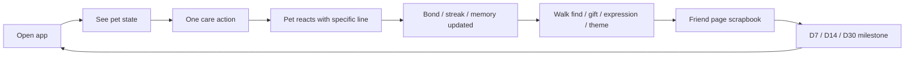

# Mongchi Integrated Review - 2026-07-09

Basis: current implemented app is the source of truth. Historical planning docs were treated as context only.

Evidence:
- iOS Simulator: iPhone 16 Pro, iOS 18.6.
- Route screenshots: `docs/qa-screenshots/current-audit-20260709/tripleslash-contact-sheet.png`.
- Interaction screenshots: `docs/qa-screenshots/current-audit-20260709/interactions-contact-sheet.png`.
- Code areas: `apps/mobile`, `packages/shared/src`, `services/api`, `workers/ai`, `supabase`.

## Implementation Evidence

- Current route tree: `apps/mobile/app` contains `chat`, `friend`, `generation`, `inventory`, `onboarding`, `pet-reveal`, `pet-setup`, `photo-upload`, `privacy`, `settings`, `shop`, `support`, `terms`, `terrarium`, and `welcome`.
- Home actions: `apps/mobile/src/features/terrarium/terrariumHomeInteractionContract.ts:3` exposes `feed`, `play`, `walk`, `affection`, and `water_garden`; `rest` exists in cooldown/domain but is not a floating dock action.
- Home trays: `apps/mobile/src/features/terrarium/terrariumHomeCareMenu.ts:28` defines base menu options, and `:85` maps `Bath` into the Water tray as `clean`.
- Relationship milestones: `packages/shared/src/session/prototypeSession.ts:350` defines `[7, 14, 30]` day milestones.
- Walk and early return: `packages/shared/src/session/prototypeSession.ts:1474` and `:1503` implement early walk return and paid credit early return.
- Plus visibility gap: `apps/mobile/src/features/shop/ShopPreviewScreen.tsx:247` filters out premium pass products from visible commerce cards.
- Credit mismatch: `packages/shared/src/mock/mockData.ts:142` starts local demo wallet with `0` credits, `25` bonus credits, and `3` free chat tickets, while `supabase/migrations/0004_credit_ledger.sql:29` says server cash-like credits do not include `bonusCredits`.
- Paid chat authority risk: `apps/mobile/src/features/session/apiPremiumChatSession.ts:130` sends client-chosen `charge`; `supabase/functions/chat-turn/index.ts:798` trusts `charge === "free"` as already paid locally.
- AI generation split: `packages/shared/src/domain/assets.ts:4` defines 16 states; `workers/ai/src/pipeline.ts:18` uses all states for Node first pass; `supabase/migrations/0001_init.sql:29` defaults Supabase jobs to `{idle,happy,sleep}`.
- Supabase state fanout: `supabase/functions/generate-avatar/index.ts:1142` generates one call per required state; `:167` caps expression pack requests at 6 states.
- Notification conflict: `apps/mobile/src/features/notifications/notificationScheduler.ts:123` cancels all scheduled notifications, while `apps/mobile/src/features/terrarium/TerrariumHomeScreen.tsx:1535` schedules walk-return notifications separately.

## Executive Summary

Mongchi already has a strong emotional product core: real-photo onboarding, named pet profile, cozy terrarium home, care actions, walk sessions, memories, expression packs, friend page, chat, and shop. The current app does feel close to "my pet lives inside my phone."

The main gap is not raw feature count. It is orchestration. The emotional loop, 30-day relationship milestones, commerce, chat, generation, and notifications exist, but they are not yet presented as one clear daily relationship spine. The most important next milestone should be:

> Build a 30-day relationship spine and make paid AI/credit authority server-side before adding more content.

## Documentation Results

New SSoT docs:
- `docs/README.md`
- `docs/archive/README.md`
- `docs/current/documentation-audit-2026-07-09.md`
- `docs/current/integrated-review-2026-07-09.md`

Deprecated:
- `docs/dummy/**`
- `docs/product/placement-items-archive.md`
- `docs/multi-pet-slot-plan.md`
- `docs/retention-gap-analysis.md`
- `docs/mvp-slice-status.md`

Updated:
- `docs/app-shell.md` route list was stale. The implemented route tree includes `/friend`, `/privacy`, `/support`, `/terms`, and `/welcome` in addition to the previous flow routes.

## Simulator QA Report

Captured screens:
- Chat, Friend/Profile, Generation, Inventory, Onboarding, Pet Reveal, Pet Setup, Photo Upload, Privacy, Settings, Shop, Support, Terms, Terrarium, Welcome.
- Interaction flow: home reset, play tray, play executed, water tray, bath executed, bond tray, pet executed, walk tray, walk started, early walk return.

Passes:
- Home/terrarium renders coherently with full-bleed garden, pet, HUD, side buttons, dock, speech bubble, and current pet status.
- Chat opens as a home-overlay style screen with input, long-chat affordance, and AI disclaimer.
- Friend/Profile has the strongest attachment surface: bond, streak, days together, habits, walk finds, scrapbook, and expression gallery.
- Play, bath, pet, walk, and early-return actions executed in the simulator and produced visible feedback/toasts/cooldowns.
- Legal/support/settings screens are present and readable.

Issues:
- Generation route showed `Move-in paused: Could not check on your companion's progress.` during route QA. This is a valid error state, but it means the live generation path must be re-tested with configured backend credentials.
- Shop item names truncate awkwardly in cards, for example `Sweet Potato Che...`. This weakens polish in a commerce-critical screen.
- Settings surfaced `Privacy action needs attention` in the captured state. This may be state-derived, but the error/needs-check status should be clearer.
- Care actions often open trays first. This is consistent, but `pet` and `play` feel less immediate than direct pet toys usually do.
- Some tray item activation needed coordinate tapping after accessibility element clicks focused the item. VoiceOver activation should be retested.
- Early walk return quickly moved through the gift-ready state. The reward claim moment may be too easy to miss visually.

## Product Review

Healing:
- Strong: cozy garden, soft pet lines, gentle timers, care without harsh failure.
- Missing: a visible daily emotional reason to come back. The app has memories and milestones, but Home does not yet frame "today with Mong" as the central experience.

Attachment:
- Strongest implemented surface is Friend/Profile, not Home. Friend shows bond/streak/days/walk finds/letter-like progression.
- Home should borrow a small version of that attachment spine: one daily memory, one current need, one tiny progress beat.

Game feel:
- Implemented: feed, treats, play, bath/clean, affection/pet, walk, early walk return, shop, inventory, themes, expression packs, chat.
- Missing or under-surfaced: rest/sleep as first-class action, random events, stronger toy reactions, growth stages, collection album payoff, and daily/weekly reward presentation.

## Retention Review

Day 1:
- Good. Photo-to-pet, naming, reveal, first care, and terrarium entry create an emotional hook.

Day 3:
- Medium. Care streak and local loops exist, but the UI does not yet celebrate routine formation enough.

Day 7:
- Medium. `DAYS_TOGETHER_MILESTONES = [7, 14, 30]` exists in `packages/shared/src/session/prototypeSession.ts`, but Home should point users to the milestone moment.

Day 14:
- Weak-medium. Needs a new relationship beat, not just another toast.

Day 30:
- Promising. The product has a 30-day letter concept, but it should become the emotional payoff of the first month.

Push notification strategy:
- Keep push soft and pet-authored.
- Fix notification ownership: global daily sync cancels all scheduled notifications, while walk return schedules a separate notification. A later sync can wipe the walk return.
- Push should support: rest, walk return, gentle visit reminder, D7/D14/D30 milestone, and shop/pack only after attachment is proven.

## UX / UI Audit

Strengths:
- Pixel-gloss garden UI is cohesive.
- Main HUD, dock, shop, friend, legal, and onboarding now feel like one product family.
- Home has clear buttons and a strong first-viewport pet signal.

Risks:
- Tray-first interactions reduce immediacy. Direct pet tap/drag should produce instant delight even if buttons open richer trays.
- Shop is clear but still catalog-like. It should feel more like a cozy atelier/nursery.
- Generation failure state is understandable, but the route QA state reads as a real blocking problem.
- Long legal/support screens are readable but should preserve stronger bottom-safe-area affordance in smaller screenshots.

## Technical Review

Current architecture:
- Mobile prefers Supabase generation when a Supabase client exists, then falls back to prototype or Node API paths.
- Node/Postgres/worker path has richer schema and batching.
- Supabase path is mobile-preferred for generation/chat in configured builds.
- Shared domain holds care, inventory, wallet, relationship, expression packs, theme bundles, memories, and prototype session logic.

Key risks:
- Backend SSOT is split between Supabase and Node/Postgres.
- Node HTTP router casts request bodies directly before service methods; schema parse boundaries should be explicit.
- Node server awaits `router.handleAsync` inside an unhandled async task; top-level request catch should be added.
- Node worker job claim uses `FOR UPDATE SKIP LOCKED`, but there is no lease/heartbeat/reaper.
- Generated asset metadata is not yet animation-ready: static PNGs have no frame atlas, anchor/contact points, hitboxes, or timing.

## Security Review

Critical/high:
- Premium Supabase chat trusts client `charge: "free" | "credit"`. Mobile sends `charge` based on local wallet/entitlement preview, and the Edge Function only debits credits when `charge === "credit"`. A direct caller with a valid session can forge `charge: "free"`.
- Chat prompt context is client-authored. Pet profile, memory, care, summary, recent messages, and user text travel in the request, so provider prompts must treat this as untrusted context.
- Supabase chat rate limiting is conversation/pet scoped enough that rotating client pet IDs/conversation IDs can multiply throughput unless user-level ownership/rate limits are added.

Medium:
- Upload completion trusts client metadata too much. Server should verify size/type/checksum before marking uploads complete.
- Supabase Storage owner path policy is useful, but size/type controls need more server-side checks.
- Dev/public env validators currently fail on allowed/dev flags and should be reconciled before release.

Strengths:
- Node JWT verifier checks RS256, issuer, audience, exp, nbf, and JWKS.
- Supabase generation uses RLS patterns and server-role writes.
- Credit ledger RPCs are atomic/idempotent for paid generation paths.
- Native mobile auth tokens use SecureStore.

## AI Pipeline Review

Current:
- Shared domain defines 16 generated asset states.
- Node worker first pass defaults to all shared states and supports sheet batching (`statesPerSheet` 4 or 6).
- Supabase DB defaults generation jobs to `{idle,happy,sleep}`.
- Supabase Edge Function generates one image edit call per requested state in parallel and caps expression pack requests at 6 states.

10+ expression expansion:
- Do not expand first-pass Supabase generation to 10+ until entitlement, charge, asset manifest, cache, and metadata are unified.
- Supabase 10 states = 10 parallel image calls. 16 states = 16 calls.
- Node batching can reduce calls to `ceil(states / 4)` or `ceil(states / 6)`, but that is not the mobile-preferred path today.
- Storage, signed URL refresh, mobile cache entries, and QA all scale linearly with state count.

Recommended:
- Keep first pass to 3 core states.
- Generate expression packs incrementally.
- Add manifest metadata: required states, model, prompt version, quality calibration id, states-per-sheet, source asset ids, asset-set version, mime/quality fields.
- Cache by `assetId + version/contentHash`; refresh signed URLs on demand.

## BM Review

Current implemented monetization ingredients:
- Plus/premium chat concept.
- Credits, bonus credits, free chat tickets.
- Expression packs.
- Themes.
- Treat/toy/rest/path consumables.
- Paid early walk return.
- Native store integration via `expo-iap`.

Main BM gaps:
- Plus pass is defined but filtered out of visible shop product entries in current shop presentation.
- Starter wallet shows `0` paid credits, `25` bonus credits, and `3` free chat tickets. Server paid credit wallet explicitly excludes `bonusCredits`, so UI can imply spendable value that cannot pay for OpenAI-backed features.
- Paid AI work must be server-authoritative before launch conversion tests.

Recommended BM:
- Free: core care, first pet, 3 core expressions, gentle daily rhythm.
- Paid credits: AI-cost features only, such as expression generation and paid chat when no Plus entitlement.
- Plus: long chat, monthly expression allowance, seasonal theme drops, priority generation/retry comfort, extra relationship archive.
- Cosmetic packs: seasonal backgrounds, emotion packs, special walk packs.
- Defer furniture/placeable decor until the retired placement system is intentionally revived.

## Benchmark Summary

Lazyweb quick search evidence covered:
- Virtual pet home references.
- Pet app onboarding references.
- Mobile shop/category references.
- Daily habit reward references.

External pattern conclusions:
- Finch: best reference for gentle onboarding and daily self-care/attachment framing.
- Widgetable / Pixel Pals: ambient presence and glanceable pet companionship.
- Pou / My Talking Tom: direct pet affordances and toy-like reactions.
- Spirit City: cozy world coherence and routine atmosphere.
- Daily reward apps: strong cadence, but Mongchi should soften them into visits, care blooms, and low-pressure continuity.

Lazyweb hosted report:
- Attempted with the current home screenshot, but the upload request returned HTTP 429. Keep quick-search benchmark evidence for now and retry hosted report generation later.

## Priorities

Critical:
- Make premium chat payment/entitlement server-authoritative.
- Choose Supabase or Node/Postgres as production SSOT for paid AI flows.
- Resolve release-blocking validators: mobile assets, mobile flow, secret boundaries, env examples, mobile copy, and Deno `fast-png` test setup.
- Fix notification ownership so daily sync does not cancel walk-return notifications.

High:
- Expose Plus pass/paywall clearly from Chat and Shop.
- Split paid credits vs bonus/local currency in UI and server rules.
- Add visible Home "today with Mong" relationship module.
- Make Rest/Sleep a first-class Home affordance.
- Add generation manifest/cache/version metadata before 10+ expressions.
- Retest generation route with configured backend.

Medium:
- Improve direct pet interaction immediacy.
- Fix shop card truncation.
- Add clearer gift-claim moment after walk return.
- Add accessibility activation tests for tray item cards.
- Add diegetic loading/error/empty states.

Low:
- Full docs taxonomy migration after validators/path consumers are updated.
- Furniture/placeable decor revival.
- Widget/lock-screen ambient pet surface.
- Animation atlas metadata and richer motion packs.

## vNext Roadmap

vNext 0 - Release hygiene:
- Fix server-authoritative paid chat.
- Fix validation gates.
- Fix notification scheduling ownership.
- Refresh docs SSoT and app shell route map.

vNext 1 - 30-day relationship spine:
- Home daily relationship card.
- D1/D3/D7/D14/D30 visible beats.
- Friend scrapbook as payoff destination.
- Softer push/reminder plan.

vNext 2 - Care game feel:
- Direct pet tap/drag reaction.
- First-class Sleep/Rest.
- Stronger walk gift claim.
- Better toy/treat/bath reaction variety.

vNext 3 - BM and shop:
- Visible Plus pass.
- Credit policy cleanup.
- Expression packs as incremental paid generation.
- Seasonal themes/emotion packs.

vNext 4 - AI pipeline scale:
- Backend SSOT decision.
- Generation manifest/version/cache metadata.
- Batched or incremental state generation.
- Animation-ready asset metadata.

## Validation Snapshot

Passed in this audit run:
- `npm run typecheck`
- `npm --workspace @mongchi/mobile run typecheck`
- `npm test`
- `npm run validate:ios`
- `npm run validate:android`
- `npm run build:landing`
- release/store/db/privacy validators that were run earlier in the audit passed.

Failed or blocked:
- `npm run validate:mobile-assets` - stale generated onboarding PNGs plus catalog/manifest drift for food, treat, toy, decor, currency, and seasonal items.
- `npm run validate:mobile-flow` - expects an older first-session progress component/copy contract and older inventory/shop/settings labels.
- `npm run validate:mobile-secret-boundaries` - flags `walkReturnNotification.ts` plus unsupported public env keys for dev store unlock and store screenshot weather.
- `npm run validate:env-examples` - missing `EXPO_PUBLIC_TINY_PET_STORE_SCREENSHOT_WEATHER_CONDITION` in `apps/mobile/.env.example`.
- `npm run validate:mobile-copy` - flags implementation-detail comments and Korean memo strings in English UI scan targets.
- `deno test supabase/functions/...` due missing `npm:fast-png@7` in the current Deno/npm setup.
