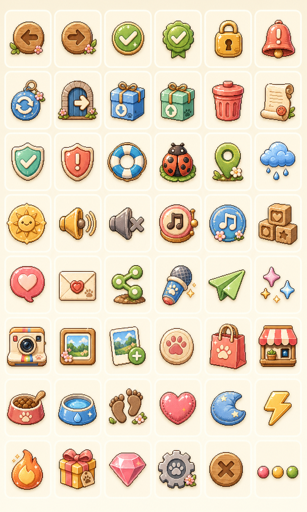

# MongChi 종합 제품·UX·iOS·QA 감사

감사일: 2026-07-10
대상: 현재 공유 worktree와 iPhone 16 Pro 시뮬레이터 빌드
관점: Lead Game Designer · Senior UX Designer · Senior iOS Engineer · QA Lead

## 감사 범위와 증거 신뢰도

- 16개 앱 라우트와 관련 presentation/session/domain/backend 코드를 검토했다.
- 최신 시뮬레이터 원본 캡처는 로컬 QA 산출물로 보관하며 Git에는 포함하지 않는다.
- 화면 판단은 2026-07-10 iPhone 16 Pro 캡처 세트와 현재 코드를 교차 검증한 결과다.
- 케어 실탭 contact sheet와 홈 모션 녹화는 로컬 QA 증거로 보관한다.
- 2026-07-09의 settled contact sheet는 파일명과 화면이 한 칸씩 어긋나므로 현재 판정의 근거로 사용하지 않았다.
- 테스트는 137개 파일, 1,308개가 통과했고 shared/api/worker/mobile TypeScript 체크도 통과했다.
- 반면 모바일 접근성 validator는 19건 실패했고 iOS preflight는 stale asset validator 때문에 실패했다.
- App Store Connect 상품 등록, StoreKit sandbox 구매·복원, RevenueCat webhook, 실제 기기 햅틱·오디오, VoiceOver, Dynamic Type 200%, Reduce Motion은 저장소와 시뮬레이터만으로 최종 검증할 수 없었다.
- 감사 대상 worktree에는 대규모 사용자 변경이 이미 존재했다. 본 감사에서는 제품 코드를 수정하지 않았다.

---

## Executive Summary

MongChi는 다시 디자인해야 하는 앱이 아니다. 홈, 펫 캐릭터, 웰컴, 아이템 아트, 정원 배경은 이미 차별화된 “따뜻한 휴대용 펫 토이” 정체성을 갖고 있다. 특히 실제 반려동물 사진을 나만의 캐릭터로 바꾸고, D7 기억과 D30 편지로 관계를 쌓는 핵심 약속은 강하다.

출시를 막는 문제는 콘텐츠 양보다 시스템 연결이다.

1. 실제 API 경로에서 스트릭·기억·버프·산책 도감 등 리텐션 핵심 상태가 누적되지 않는다.
2. 화면 잔액, Supabase AI 크레딧, StoreKit/API 지갑이 서로 다른 경제다. 이것이 Out of Credit의 직접 원인이다.
3. 첫 생성은 종 선택 전에 시작되어 고양이 사진도 기본값 dog로 요청된다.
4. 구매 가능한 크레딧 팩·Plus 상세·Restore Purchases가 연결되어 있지 않다.
5. 포즈로 기획한 상품이 실제 코드에서는 상황별 Expression/Moment Pack이며, “idle pose 3개”를 표현할 데이터 모델이 없다.
6. 지원, 생성 실패, 재설치 복원, 부분 온보딩 복귀가 데드엔드다.
7. 1,308개 테스트가 통과하지만 최신 XCUITest는 Water HUD를 누르고 Walk 경로만 열어도 케어 성공으로 통과한다.
8. 홈 비주얼은 완성도가 높지만 SFX·BGM·ambience 전체와 일부 펫 상태 자산은 명시적인 placeholder다.

제품 전략은 “더 자주 배고프게 만들기”가 아니라 “펫이 먼저 작은 사건을 만들고, 사용자의 같은 행동에도 조금씩 다르게 반응하게 하기”여야 한다. monetization은 유료 가챠보다 구성 공개형 Moment/Pose Pack이 MongChi의 애착·신뢰 모델에 맞다.

출시 권고는 조건부 보류다. 아래 P0가 닫히기 전에는 실제 결제와 유료 AI 생성을 켜면 안 된다.

---

## Critical Issues (Highest Priority)

| ID | 화면/근거 | 심각도 | 문제와 이유 | 권장 해결 | 복잡도 |
|---|---|---:|---|---|---:|
| P0-01 | Photo Upload → Pet Setup → Generation; PhotoUploadScreen.tsx:115-117, prototypeSession.ts:254-260, supabaseGenerationSession.ts:271-284 | Critical | 사진 확정 직후 생성이 시작되지만 species 기본값은 dog이고 Pet Setup에는 종 확인/수정이 없다. 고양이 사진을 강아지로 생성할 수 있어 핵심 약속을 직접 훼손한다. | 사진 분석 후 Dog/Cat 자동감지 confidence를 표시하고 낮은 confidence에서는 사용자 확인을 필수화한다. 종 확정 전에는 생성 요청을 금지한다. | L |
| P0-02 | Home, Profile, Walk collection; apiDailyLoopSession.ts:190-219, 325-380 | Critical | API 케어 경로는 relationship과 일부 inventory만 갱신한다. 로컬 경로에 있는 careStreak, careStats, memories, buffs, walkCollection이 생산 경로에서 누적되지 않는다. D3/D7 보상·기억·개인화가 정지한다. | 서버 케어 명령을 단일 트랜잭션으로 만들고 care, relationship, streak, stats, memories, buffs, collection, wallet/rewards를 하나의 스냅샷으로 반환한다. 로컬/API 동일 시나리오 계약 테스트를 둔다. | XL |
| P0-03 | Shop > Moments; 01-shop.png, wallet.ts:50-51, 0004_credit_ledger.sql:29-38, generate-avatar/index.ts:1675-1692 | Critical | UI는 credits + bonusCredits 또는 개발 9999를 보여주지만 Supabase는 bonus를 제외한 paid balance만 12 차감한다. 화면에 잔액이 있어도 서버는 402를 반환한다. | 소비 가능한 통화를 Supabase 단일 서버 원장으로 통합한다. bonus도 grant ledger로 지급하고 hydrate 완료 전 구매 CTA를 잠근다. | L |
| P0-04 | Shop, Chat, Settings; ShopPreviewScreen.tsx:196-209, 246-256, SettingsScreen.tsx:216-242 | Critical | StoreKit 성공은 services/api Postgres 지갑으로 지급되지만 Moment Pack은 Supabase 지갑을 소비한다. regen 1-credit SKU는 Shop에 노출되지 않고 Plus도 숨겨지며 Restore UI는 주석이다. 결제 후에도 해금되지 않는 구조다. | Supabase를 구매·지갑·entitlement 단일 진실원으로 확정한다. RevenueCat/Apple 검증 webhook이 멱등 grant_credits를 호출하게 하고 20/60/150 번들, Plus 상세, Restore를 연결한다. | XL |
| P0-05 | Shop 9999/DEV OPEN; 01-shop.png | Critical | 현재 QA 화면은 실결제가 아니라 개발 플래그로 전 상품이 열린 상태다. 이 상태에서는 부족 잔액·취소·pending·복원을 검증할 수 없고 스토어 캡처 유출 위험이 있다. | production/archive/store-screenshot 빌드에서 dev unlock 코드를 컴파일 타임으로 제거하고 CI가 DEV OPEN/9999 문자열을 차단하도록 한다. | S |
| P0-06 | Generation; route-generation.png | Critical | 진행 목록은 거의 완료처럼 보이는데 동시에 Move-in paused 오류가 나타난다. 재시도·사진 변경 CTA는 첫 뷰포트 아래에 있어 사용자가 갇힌다. | 오류 카드 내부에 다시 시도, 사진 변경, 나중에 계속을 배치하고 실패 시 진행률과 단계 상태를 실패 지점에 고정한다. | M |
| P0-07 | Support; route-support.png, SupportScreen.tsx:73-76, 91-107 | Critical | Email support가 비활성이고 report는 로컬 카테고리 저장뿐이다. 데이터 삭제·결제 문제의 실제 해결 채널이 없다. | 실제 운영 이메일 또는 서버 티켓 API, 접수 번호, 전송/재시도 상태를 제공한다. FAQ와 Settings의 직접 삭제 설명을 일치시킨다. | M |
| P0-08 | Supabase chat and migrations; chat-turn/index.ts:749-830, migrations/0006_conversations.sql | Critical | 채팅 과금 종류를 클라이언트가 free로 결정하고 OpenAI 호출이 차감보다 먼저다. 일부 SECURITY DEFINER RPC는 배포 상태에 따라 public 실행 위험이 있다. 비용 우회·중복 비용·대화 변조 위험이다. | 서버가 entitlement/무료 티켓/credit을 원자적으로 reserve→provider→commit/refund한다. RPC revoke/grant와 소유권 검사를 live DB에서 검증한다. | L |
| P0-09 | services/api 전반; postgresApiService.ts, directStorePurchaseVerifiers.ts | Critical if deployed | 운영 adapter 기본 시계가 2026-06-24로 고정되어 App Store JWT가 현재 즉시 만료된다. 구매·케어·산책·채팅 타임스탬프도 왜곡된다. | 생산 코드에서 모든 고정 시계를 제거하고 injectable clock은 테스트에서만 주입한다. 실제 JWT iat/exp 통합 테스트를 둔다. | S |
| P0-10 | services/api 경제/채팅/산책; postgresClient.ts, postgresApiService.ts | Critical if deployed | 구매·지갑·entitlement·walk claim·chat write가 여러 read-modify-write로 나뉘고 transaction API가 없다. 동시 요청 시 lost update와 부분 커밋이 가능하다. | DB transaction과 row lock 또는 원자 SQL/RPC로 묶고 idempotency key·unique constraint를 추가한다. | L |

---

## Gameplay & Retention Review

### 현재 강점

- 상태 감쇠는 최저 15점 바닥과 저상태 회복 배수를 사용해 복귀 사용자를 과도하게 벌주지 않는다.
- 스트릭은 하루 공백 grace와 D3/D7 간식 보상이 있다.
- 유대 레벨 L2/3/4/5/7/10 보상이 구현되어 있다.
- 3분 비동기 산책, 날씨별 9종 수집, 희귀도, 도감 완성 보상은 짧은 idle loop로 좋다.
- 기억 타임라인, 습관 요약, D30 편지는 애착을 만드는 강한 자산이다.
- 낮/밤, 아침 기지개, 40~90초 자율 표정, 나비 방문은 정원을 살아 있게 만든다.

### 리텐션 단계 판정

| 기간 | 현재 동기 | 판정 | 권장 보강 |
|---|---|---|---|
| D1 | 첫 사진, 이름, 첫 케어, moved-in 기억 | 강함 | 첫 행동별 고유 반응과 “오늘 처음 함께한 일” 카드 |
| D3 | 3일 스트릭 간식 | 좋음 | daysTogether가 아니라 실제 streak 2/3 진행 표시 |
| D7 | 특별 간식, 7일 기억, 홈 카드 | 가장 완성됨 | 첫 scrapbook page와 공유 가능한 기념 카드 |
| D14 | 기억/토스트 | 약함 | 새 행동 또는 첫 room micro-event 해금 |
| D30 | 개인화 편지 | 감정적으로 강하나 1회성 | 매월 새 편지와 월간 챕터 |
| D31+ | 동일 케어·산책·테마 반복 | 콘텐츠 절벽 | D60/D90, 계절 도감, 주간 스크랩북, idle 사건 |

### 게임플레이 이슈

| ID | 화면/근거 | 심각도 | 이유 | 생산형 해결안 | 복잡도 |
|---|---|---:|---|---|---:|
| G-01 | Home 전체 | High | 여러 번 접속할 쿨다운은 있지만 오전·점심·저녁의 목적이 다르지 않다. “버튼이 다시 열림”만으로는 다회 접속 동기가 약하다. | 죄책감 없는 오늘 몽치의 소원 3개 중 2개 선택 완료. 오전 인사, 낮 산책, 밤 휴식으로 시간대 경험을 다르게 한다. | M |
| G-02 | Profile/Memory | High | L10, D30 이후 새 행동·기념일·편지가 사실상 끝난다. | L15/20/30, D60/D90, 반복 월간 편지, 계절 수집, 주간 scrapbook chapter를 추가한다. 숫자보다 행동·대사·표정 해금을 우선한다. | L |
| G-03 | Home dock; care contracts | High | Rest가 도크에 없고 쿠션은 affection으로 실행되지만 buff는 rest를 강화한다. 에너지 회복 loop가 숨겨져 있다. | 도크를 늘리지 말고 저녁에는 Pet 슬롯을 Nap 추천으로 전환하고 cushion 선택을 실제 rest action으로 라우팅한다. | M |
| G-04 | Shop Toys, CareMomentLayer | High | 실제 장난감은 ball/plush 2종이고 구매 장난감도 공 연출을 공유한다. 구매 가치와 반복성이 약하다. | action + itemId + phase 연출 계약을 만들고 유료 장난감마다 고유 동작·사운드·대사 최소 2종을 보장한다. | L |
| G-05 | Home idle | High | 자율 행동은 세션 안 표정 장식이고 앱을 닫아 둔 동안 펫이 한 일이 없다. | 하루 1회 “몽치가 먼저 만든 작은 사건”을 저장한다. 장난감 옮기기, 낮잠 자리, 나뭇잎 선물, 창밖 보기 등을 다음 접속 카드로 보여준다. | L |
| G-06 | Notifications/Walk | High | daily scheduler가 모든 알림을 취소해 walk-return 알림도 지울 수 있고, 알림이 같은 5분에 겹치며 딥링크가 없다. | 알림 type별 identifier namespace, 선택 취소, 한 번에 1개 상태 알림, route/openCareMenu payload를 사용한다. | M |
| G-07 | Home retention card | Medium | D7과 D6/D7이 함께 노출되고 daysTogether 기반 약속이 실제 streak 보상과 다를 수 있다. | 실제 streak progress 하나만 표시하고 보상 조건을 정확히 반영한다. | S |
| G-08 | Economy | High | 초기 bonus, L5/L10, 도감 완성 외 반복 credit 수입원이 없다. 테마·Moment 가격을 장기 플레이만으로 따라갈 수 없다. | 서버 원장 통합 후 오늘의 소원 2/3 완료 시 bonus credit 1, 주 5회 한도. 중복 도감도 조각/스탬프로 가치화한다. | M |
| G-09 | Home first-use | Medium | HUD 5개, rail 4개, 말풍선, D7 카드, dock 5개가 동시에 보여 첫날 학습량이 많다. | 구조를 바꾸기보다 첫 1회 코치마크와 추천 행동 한 개만 glow 처리한다. | S |
| G-10 | Walk collection | Medium | 데이터 모델과 화면이 OS emoji를 사용하지만 이미 custom collectible PNG가 있다. | collectible id→PNG registry로 교체하고 중복 3개를 테마 조각/스크랩북 stamp로 교환한다. | S–M |

### 장난감 확장안

| 장난감 | 상호작용 | 애니메이션 | 사운드 | 재플레이 가치 | 복잡도 |
|---|---|---|---|---|---:|
| Ball V2 | 방향 스와이프 던지기 | 5개 궤적, 추격, 물고 귀환 | 고무 바운스, 발소리 | 날씨·성격별 귀환 반응 | M |
| Frisbee / Flying Disc | 곡선 스와이프 | 달리기→점프 캐치→착지 | 바람, 잔디 착지 | 바람 세기별 궤적 | M |
| Bubble Gun | 누르고 드래그 | 시선 추적·점프·터뜨리기 | 크기별 pop | 희귀 무지개 거품 | M |
| Rope Tug | 좌우 드래그 | 몸 기울임·줄 늘어남·놓고 뒹굴기 | 천 마찰, 발 미끄러짐 | 성격별 힘과 마무리 | L |
| Buddy Plush V2 | Toss / Cuddle 선택 | 물고 흔들기 또는 품고 낮잠 | squeak, 천 소리 | 사용 횟수에 따른 최애 대사 | M |
| Sparkle Pointer | 빛점 자유 드래그 | 추적→웅크리기→pounce | 차임, 가벼운 발소리 | 사용자가 매번 다른 경로 생성 | M |
| Squeaky Bone | 방 안 3곳 중 숨기기 | 냄새→찾기→파기 | 삑, 바닥 긁기 | 위치·탐색 경로 변화 | M |
| RC Car | 짧은 드래그 조종 | 추격·코너 미끄러짐 | 모터, 바퀴, 발소리 | 일일 미니 코스 | L |
| Feather Wand | 높낮이·원형 드래그 | 웅크리기→점프→잡기 | 깃털, 작은 방울 | 종·성격 반응 분기 | M |
| Treat Puzzle | 컵 3개 중 선택 | 냄새·발로 밀기·성공 | 나무 톡톡, 간식 굴러감 | 위치 랜덤, 실패 없는 놀이 | M |
| Cardboard Tunnel | 출구 순서 탭 | peek→엉뚱한 구멍→질주 | 종이 바스락 | 순서·표정 변화 | M |
| Wind-up Mouse | 방향 선택 | 지그재그 추격 | 태엽, 작은 바퀴 | 속도·패턴 3종 | M |

상품화는 Ball 무료, Rope/Bone/Bubble 획득형, RC/Frisbee 프리미엄이 적합하다. 모든 장난감은 구매 전 전체 동작 미리보기를 제공해야 한다.

---

## UX/UI Review

| ID | 화면/근거 | 심각도 | 이유 | 권장 해결 | 복잡도 |
|---|---|---:|---|---|---:|
| UX-01 | Welcome → Onboarding; route-welcome.png, route-onboarding.png | High | 3장 웰컴 뒤에 거의 같은 약속과 아트가 반복되어 한 탭이 중복된다. | 웰컴 완료 후 바로 Photo Upload로 이동하거나 두 번째 화면을 사진 권한·개인정보 확인 전용으로 바꾼다. | M |
| UX-02 | Photo Upload; route-photo-upload.png | High | 선택된 사진 카드에 실제 사진 대신 청록색 사각형이 보인다. 핵심 신뢰 순간이 placeholder처럼 읽힌다. | 실제 thumbnail, loading/error, 교체·삭제 CTA를 제공하고 실사진 fixture로 QA한다. | M |
| UX-03 | Pet Setup; route-pet-setup.png | High | Dog / Gentle이 수정 불가능하고 긴 폼 끝에만 Continue가 있다. 키보드와 작은 화면에서 진행이 불명확하다. | 감지 종 수정, Photo→Personality→Meet 단계 표시, 필수/선택 구분, sticky CTA를 적용한다. | M |
| UX-04 | Reveal; route-pet-reveal.png | High | Meet Mong과 작은 재시도 링크가 복잡한 정원 위에 직접 놓여 대비와 터치성이 낮다. | 작은 parchment ribbon 또는 국소 scrim, 최소 44pt 링크 영역을 사용한다. | S |
| UX-05 | 전체 navigation; app/_layout.tsx | High | 모든 transition animation과 iOS back gesture가 전역 비활성화되어 장면 전환이 갑작스럽고 플랫폼 기대를 어긴다. | 비파괴 화면은 swipe-back을 복원하고 onboarding은 slide, game scene은 160–220ms fade를 사용한다. | M |
| UX-06 | Chat; route-chat.png | High | 마이크는 버튼처럼 보이지만 단순 View다. Long chat 문구와 달리 최근 3개만 렌더링한다. | 음성 입력 전에는 mic를 제거하고 전체 대화 스크롤/페이지네이션 또는 View history를 제공한다. | M |
| UX-07 | Inventory; route-inventory.png | Medium | Give now가 가능하지만 카드가 정적 갤러리처럼 보인다. | Give 리본/화살표, pressed feedback, 사용할 수 없는 이유를 표시한다. | S |
| UX-08 | Settings; route-settings.png | High | Little reminders에 날씨와 위치만 있고 실제 알림 설정이 없다. 삭제 버튼 대비도 약하다. | Weather scenes와 Notifications를 분리하고 권한·시간·system settings CTA를 제공한다. destructive AA token을 사용한다. | M |
| UX-09 | Backup/Restore; SettingsScreen.tsx | Medium | JSON 붙여넣기 복구는 소비자 앱보다 개발 도구처럼 보인다. | Files/iCloud picker, 검증 summary, 복구 전 확인, 실패 원인별 회복을 제공한다. | M |
| UX-10 | Privacy/Terms/Support | Medium | 큰 흰 문서 카드가 일반 웹 법무 페이지처럼 보이고 Dynamic Type에서 과도한 스크롤 위험이 있다. | 양피지 목차, 핵심 요약, 접이식 section, 자동 높이 legal card primitive를 만든다. | M |
| UX-11 | Returning user; SplashScreen.tsx | High | petProfile과 acceptedAsset이 없으면 partial state를 모두 onboarding으로 보낸다. 사진 선택·생성 중·완료 후 reveal 전 복귀가 구분되지 않는다. | persisted onboarding state machine과 generation resume route를 둔다. | M |
| UX-12 | Account deletion; Settings | High | 서버 삭제 실패 후 로컬 펫은 지워지고 “나중에 Settings에서 재시도”하지만 사용자는 onboarding으로 이동해 Settings에 갈 수 없다. | pending deletion을 영속화하고 다음 실행 첫 화면에 삭제 마무리 CTA를 제공한다. | M |
| UX-13 | Profile; route-friend.png | High | 최신 캡처에서 핵심 pet/pose 영역이 비고 반투명 capsule과 pager만 남는다. | owned pose fallback을 항상 렌더하고 loading/error/empty를 분리한다. | M |
| UX-14 | Shop; 01-shop.png | Medium | 네 탭이 좁고 Sweet Potato Che...처럼 상품명이 잘리며 price/owned/applied badge 문법이 섞인다. | 수평 scroll tabs, 2줄 상품명, price·quantity·applied 상태 분리, theme room preview를 사용한다. | S–M |

---

## Animation & Visual Polish

### 현재 장점

- 풀블리드 정원과 펫이 중심이고 HUD, rail, dock이 실제 게임 자산처럼 결합되어 있다.
- 글로시 버튼, parchment card, cocoa outline, 따뜻한 palette가 일관적이다.
- reveal, heart burst, gift, loading Lottie와 confetti/particle 기반이 이미 있다.

### 미완성·임시·generic 목록

| ID | 화면/근거 | 심각도 | 이유 | 권장 해결 | 복잡도 |
|---|---|---:|---|---|---:|
| VP-01 | 전체; audioAssets.ts, bgmAssets.ts, ambienceAssets.ts | High | SFX 12, BGM 2, ambience 2가 모두 합성 sine/triangle placeholder로 명시되어 있다. | 식기·천·발소리·고무·정원 field recording 중심의 최종 Foley로 16개 전량 교체한다. | M–L |
| VP-02 | Pet states; generatedPetAssets.tsx | High | sad, sick, messy가 hungry, sleep, walk-return 이미지를 재사용한다. 감정 상태가 잘못 읽힌다. | dog/cat 각각 sad/sick/messy 전용 6개 자산을 제작한다. | M–L |
| VP-03 | Care moments | High | Feed/Water/Play/Pet/Clean 일부만 있고 Treat/Rest/Talk 고유 장면이 없다. | 행동마다 최소 3단계 entrance→interaction→resolution을 만든다. | L |
| VP-04 | Generation; route-generation.png | Medium | 아름다운 광원 중앙의 일반 ? 배지가 임시 자산처럼 보인다. | 발바닥 봉인, 문틈 실루엣 등 MongChi 고유 mystery token으로 교체한다. | S |
| VP-05 | Home care test; care-flow-contact-sheet.png | Medium | 반복 행동에서 펫 pose 변화가 작고 toast/말풍선 중심이라 시각적 보상 차이가 약하다. | itemId 기반 pose, prop, reaction, particle를 묶어 행동별 signature moment를 만든다. | L |
| VP-06 | Motion 전반 | High | 일부 화면만 Reduce Motion을 따르고 펫 호흡, rail bob, Lottie loop가 계속 돈다. | 공용 motion policy를 모든 무한 animation에 전달하고 정지 poster frame을 정의한다. | M |
| VP-07 | Source styles | Medium | 31개 파일에 raw color literal이 남고 화면별 spacing/radius가 부분적으로 분기된다. | DESIGN token registry로 이동하고 raw color CI rule을 추가한다. | M |

---

## Audio & Haptic Feedback

현재 wiring 자체는 좋다. 케어 성공, 레벨업, 편지, reveal에 SFX·햅틱 연결점이 있고 audio manager도 분리되어 있다. 문제는 최종 자산과 정책이다.

| 이슈 | 화면/근거 | 심각도 | 권장 해결 | 복잡도 |
|---|---|---:|---|---:|
| 모든 오디오 placeholder | 전체 | High | curated Foley로 교체하고 walk 전용 footstep, bath 전용 splash를 추가한다. 실제 짖음/울음은 사용자의 실제 반려동물 정체성과 충돌할 수 있어 과도하게 사용하지 않는다. | M–L |
| SFX와 haptic이 한 토글 | Settings | Medium | Sounds와 Haptics를 분리하고 시스템 설정과 동기화한다. | M |
| 구매/해금 haptic 불일치 | Shop/Profile | Medium | purchase pending은 없음, success는 soft success, 오류는 warning, reveal은 success+sparkle처럼 패턴을 표준화한다. | S–M |
| silent switch 정책 불일치 가능 | soundManager.ts | Medium | 실제 archive에서 iOS silent switch 동작을 확인하고 playsInSilentMode 설정·문구를 일치시킨다. | S |
| audio crossfade timeout race | bgmPlayer/ambiencePlayer | Medium | old stop timer가 재활성 player를 끄지 않도록 generation token 또는 cancelable timer를 사용한다. | M |

---

## Shop & Monetization

### 권장 경제 구조

1. 한 사용자, 한 서버 wallet, 한 entitlement ledger를 사용한다.
2. bonus와 paid의 회계 분리는 내부 ledger reason으로만 유지하고, 사용자가 보는 Spendable Credit은 서버가 계산한다.
3. 20/60/150 credit 번들과 Plus monthly allowance를 둔다.
4. 모든 유료 AI 생성은 reserve→generate→commit/refund를 멱등 처리한다.
5. App Store localized title, displayPrice, currency를 그대로 표시한다.
6. 구매 상태는 idle, loading, pending approval, verifying, granted, cancelled, failed로 구분한다.
7. Restore Purchases와 재설치 복원을 Settings와 paywall 모두에서 제공한다.
8. consumable은 active entitlement로 재구매를 막지 않는다.

### Shop 이슈

| ID | 화면/근거 | 심각도 | 이유 | 해결 | 복잡도 |
|---|---|---:|---|---|---:|
| M-01 | Chat → Shop | Critical | Plus CTA가 /shop으로 가지만 premium product는 필터링된다. | 전용 Plus detail/paywall route로 직접 연결한다. | M |
| M-02 | Shop | Critical | 12-credit Moment Pack에 1-credit regen SKU만 있고 그마저 카테고리 매핑이 없다. | 실제 credit bundles와 Get Credits wallet sheet를 추가한다. | L |
| M-03 | Settings | Critical | Restore Purchases가 주석 처리되어 durable/subscription 복구가 없다. | StoreKit transaction history와 서버 entitlement 재수화를 연결한다. | M |
| M-04 | Shop purchase feedback | High | requestPurchase 시작 직후 성공음을 내고 최종 verify 결과를 화면에 충분히 보여주지 않는다. | 검증 완료 후 success를 재생하고 pending/cancel/failure 상태를 card와 dialog에 표시한다. | M |
| M-05 | Ownership | Critical | Moment pack ownership이 local inventory라 재설치·기기 변경·local write 실패 시 유료 자산을 잃는다. | 서버 entitlement에 packId/petId/asset status를 저장하고 idempotent rehydrate를 지원한다. | XL |
| M-06 | Multi-pet | High | pack ownership은 global처럼 보이지만 generated asset은 pet별이다. 새 pet에서 재구매가 막히고 asset이 없을 수 있다. | pack license와 per-pet generation entitlement를 분리한다. | L |

### 테마 확장안

현재 background 단일 교체 구조를 유지하되, 자유 배치 editor를 다시 만들기보다 day/night background + foreground micro-layer + ambience를 한 세트로 판매하는 것이 안정적이다.

| 테마 | 장식 구성 | 고유 micro-interaction |
|---|---|---|
| Cozy Room | 울 러그, 낮은 침대, 스탠드, 액자, 장난감 바구니 | 램프 켜기, 창밖 낮/밤 |
| Forest | 이끼 통나무, 버섯, 개울, 도토리, 반딧불 | 반딧불 탭, 나뭇잎 선물 |
| Beach | 조개, 파라솔, 모래 매트, 유목, 조수 웅덩이 | 파도 뒤 조개 찾기 |
| Space | 우주선 창, 달 쿠션, 별 모빌, rover, 행성 화분 | 별자리 연결, rover 추적 |
| Japanese Room | 다다미, 쇼지, 자부톤, 낮은 상, 계절 가지 | 쇼지 열기, 계절 가지 변화 |
| Modern Apartment | 목재 바닥, 소파, 플로어 램프, 큰 창 | 로봇 청소기 따라가기 |
| Camping | 텐트, 랜턴, 담요, 보온병, 솔방울 | 랜턴 밝기, 별똥별 |
| Halloween | 호박등, 가랜드, 거미줄, 간식 바구니 | 호박 표정 변화 |
| Christmas | 트리, 스타킹, 눈 오는 창, 선물 | 하루 1회 스타킹 확인 |
| Sakura Spring | 벚나무, 꽃잎, 피크닉, 종이등 | 꽃잎 잡기, 낙화 강도 |

---

## Pose System Review

### 현재 구현과 기획의 차이

현재 코드는 Idle Pose Pack A가 아니다. 다음 3개의 상황별 Expression/Moment Pack이며 각 3 state, 12 credit이다.

- Everyday Moments: curious, play, hungry
- Care Reactions: treat reaction, walk return, chat portrait
- Special Days: celebrate, garden help, seasonal

asset 모델에는 poseId가 없고 같은 idle state는 overwrite된다. equip, active idle pool, 자동 순환도 없다. 따라서 “idle pose 3개를 구매”하려면 PoseId, PosePackId, pose variant, activeIdlePosePool을 별도 모델로 추가해야 한다. Moment Pack은 상황별 자동 반응으로 유지하는 편이 제품 가치가 높다.

### 가챠 vs 공개형 팩

권장안은 Option B, 구성 공개형 확정 팩이다.

- 실제 반려동물 기반 AI 생성은 결과 자체에 이미 변동성이 있다.
- 구매 내용까지 랜덤이면 품질 불확실성과 가챠 불확실성이 겹쳐 신뢰·환불 위험이 커진다.
- 확률 공개, 천장, 중복, 연령·규제 검토 비용도 추가된다.
- reveal 애니메이션이나 무료 bonus decor만 surprise로 남기고, 소유권과 3개 구성은 명시한다.

### Profile 권장 구조

1. 상단 hero carousel은 소유한 pose만 표시한다.
2. 아래 “새로운 모습”에는 pack당 카드 한 장과 3개 storyboard thumbnail을 표시한다.
3. 아직 사용자 펫으로 생성되지 않은 결과는 canonical dog/cat concept로 보여주고 “구매 후 내 아이 모습으로 제작”을 명시한다.
4. locked pose 탭은 즉시 구매하지 않고 정확한 Shop pack detail로 deep link한다.
5. 상세에는 포함 3개, 사용 상황, 가격·현재 잔액, 생성 예상 시간, 실패 시 자동 refund/retry를 표시한다.
6. 생성 완료 후 1회 reveal, success haptic, 소유 carousel 추가를 제공한다.

| Pose 이슈 | 화면/근거 | 심각도 | 해결 | 복잡도 |
|---|---|---:|---|---:|
| 같은 idle silhouette 반복 | FriendHeroPoseSlider | High | pose별 storyboard art로 교체 | M |
| 잠금 셀에서 즉시 구매 | Profile | High | Shop detail deep link + confirmation | M |
| 실제 idle pose model 없음 | expressionPacks/assets | High | PoseId/PosePackId/pool 분리 | L |
| local-only ownership | inventory/provider | Critical | server entitlement + reinstall restore | XL |
| page 위치 VoiceOver 없음 | Friend slider | Medium | page x of y, adjustable action | M |

---

## UI Icon Consistency Review & Replacement Plan

직접 SF Symbols 사용은 0개였다. 그러나 19개 TSX 파일에서 43종 Lucide 선형 아이콘을 사용한다. 홈의 custom pixel-gloss PNG와 설정·법무·온보딩의 line icon이 서로 다른 앱처럼 보인다.

### 사용 파일

- 공용: BackButton, GardenSceneFrame
- 온보딩: WelcomeOnboardingScreen, OnboardingScreen, PhotoUploadScreen, PetSetupScreen, GenerationScreen, PetRevealScreen
- 게임: TerrariumHomeScreen, HomeCareActionTray
- 메타: FriendProfileScreen, FriendHeroPoseSlider, ChatGateScreen, InventoryScreen, ShopPreviewScreen, SettingsScreen
- 법무: PrivacyScreen, TermsScreen, SupportScreen

### 교체해야 할 43개 glyph

ArrowLeft, ArrowRight, ExternalLink, Share2, Download, Upload, Send, Camera, ImagePlus, PawPrint, Heart, Gift, Sparkles, Check, CheckCircle2, Lock, AlertTriangle, ShieldCheck, ShieldAlert, RotateCcw, Trash2, FileText, LifeBuoy, Mail, MessageCircle, Mic, MapPin, Sun, CloudRain, Volume2, VolumeX, Music, Music2, Type, Moon, Store, ShoppingBag, Bug, Flame, Footprints, Utensils, Droplets, Zap.

### 생성된 6×8 custom icon concept grid

파일: [mongchi-custom-icon-concept-grid-v1.png](./mongchi-custom-icon-concept-grid-v1.png)

| 행 | 왼쪽→오른쪽 매핑 |
|---|---|
| 1 | Back, Forward, Check, Owned badge, Lock, Alert |
| 2 | Refresh, External link, Download, Upload, Delete, Document |
| 3 | Shield check, Shield alert, Support, Bug, Location, Rain |
| 4 | Sun, Sound on, Mute, Music, Ambience, Typography |
| 5 | Chat, Mail, Share, Mic, Send, Sparkles |
| 6 | Camera, Gallery, Add photo, Paw identity, Shopping bag, Store |
| 7 | Food, Water, Walk, Affection, Sleep, Energy |
| 8 | Streak, Gift, Gem, Settings, Close, More |

이 보드는 art direction concept다. production 적용 시 각 icon을 transparent PNG로 분리하고 48pt 기준 @2x/@3x, default/pressed/selected/disabled 네 상태를 제작해야 한다.

권장 구현은 MongchiIcon 단일 registry다. 기존 shop, friend, heart, gift, path, food/water/play 자산은 재사용하고 settings/legal이 Lucide로 회귀하지 않도록 import validator를 추가한다.

---

## Code Quality & Architecture

### 규모

- 전체 주요 TS/TSX 약 99,953 LOC.
- TerrariumHomeScreen.tsx 3,870 lines.
- services/api/service.ts 3,558 lines.
- postgresApiService.ts 3,295 lines.
- TerrariumSessionProvider.tsx 2,306 lines.
- prototypeSession.ts 2,129 lines.
- GameIllustrations.tsx 1,477 lines.
- production source 250 pure LOC 초과 파일이 약 60개다.

### 구조 이슈

| ID | 화면/코드 근거 | 심각도 | 이유 | 권장 해결 | 복잡도 |
|---|---|---:|---|---|---:|
| C-01 | Supabase, services/api, workers/ai | Critical | live Supabase, 미배포 Node API, 비활성 AI worker가 인증·지갑·생성·삭제를 각각 구현한다. 진실원이 3개다. | 운영 backend 하나를 선언하고 나머지는 archive 또는 migration boundary로 격리한다. | XL |
| C-02 | mobileAuthSession + Supabase auth | Critical | production API token writer가 없고 Supabase anonymous auth는 별도 세션이다. config는 anonymous sign-in false와 충돌한다. | 단일 user identity와 Sign in with Apple/guest upgrade 정책을 만들고 모든 backend가 같은 subject를 사용한다. | L |
| C-03 | Provider:1464-1571 | High | async pack purchase 후 captured state로 setState해 중간 care/wallet 변화가 유실될 수 있다. | functional update 또는 operation reducer로 job start patch만 병합한다. | M |
| C-04 | Provider persistence | High | 매 state change AsyncStorage save가 fire-and-forget라 느린 이전 write가 최신 state를 덮을 수 있다. | serialized/coalescing writer와 revision number를 사용한다. | M |
| C-05 | Global apiSyncStatus | High | 생성·케어·구매·삭제가 한 status/error를 공유해 병렬 작업이 서로 덮는다. | operation key별 state machine으로 분리한다. | M |
| C-06 | mobileApiClient/httpRouter | Critical if API enabled | HTTP 200/null 성공 payload와 valid JSON null body가 runtime crash/hang을 만든다. | boundary Zod parse와 top-level request error boundary를 추가한다. | L |
| C-07 | root app.json + root ios | High | root bundle IDs와 실제 apps/mobile bundle ID가 다르다. 잘못된 target로 archive/signing할 위험이 있다. | 실제 mobile target만 남기고 stale root native scaffold를 archive/remove한다. | M |
| C-08 | dead candidates | Low–Medium | ShellScreen, Section, HeartShape, aiGenerationProofHarness가 runtime caller가 없다. | knip/ts-prune 검증 후 삭제 또는 명시적 experimental 폴더로 이동한다. | S |
| C-09 | Settings commented restore | Medium | 출시 핵심 코드가 큰 주석 블록으로 남아 실제 상태를 숨긴다. | feature flag 또는 별도 branch가 아니라 완성된 route와 test로 복구한다. | S |
| C-10 | Supabase generation queue | High | credit 선차감 후 Edge waitUntil best-effort이고 durable queue/lease/reaper가 없다. | durable job queue, lease, retry, refund reconciliation을 둔다. | L |

---

## Performance Review

| 이슈 | 화면/근거 | 심각도 | 이유 | 권장 해결 | 복잡도 |
|---|---|---:|---|---|---:|
| 거대 context 전체 재렌더 | Provider/Home | High | Provider의 30초 clock과 Home의 1초 clock이 큰 context와 3,870-line 화면을 반복 렌더한다. | ticker를 leaf component로 이동하고 context를 care/economy/profile/media로 분리하거나 selector store를 사용한다. | L |
| ScrollView 기반 catalog | Shop/Profile/Inventory | Medium | item/theme/pose가 늘면 모든 card와 image가 한 번에 렌더된다. | FlatList/FlashList, stable key, memoized card, image prefetch를 적용한다. | M |
| 이미지/animation 동시 부하 | Home | Medium | full-screen background, pet, particles, rail bob, HUD가 동시에 움직인다. | offscreen particle pause, reduced-motion poster, raster dimension audit, frame profiler gate를 둔다. | M |
| audio timer race | BGM/Ambience | Medium | 이전 crossfade stop timeout이 다시 활성화된 track을 끌 수 있다. | cancelable generation token을 사용한다. | M |
| API 외부 I/O timeout 부족 | worker/API | High | image/OpenAI/S3 호출 일부에 timeout/cancel/retry 정책이 없다. | operation별 timeout, abort, bounded retry, idempotency를 표준화한다. | L |

현재 iOS export는 통과했고 Hermes bundle 약 6.3MB, asset 275개를 포함했다. 크기 자체보다 long-lived render graph와 상태 fan-out이 먼저 해결할 병목이다.

---

## Accessibility Review

정적 validator는 19건 실패했다.

- disabled control의 accessibilityState 누락
- Generation/Reveal/Settings/AppDialog 버튼 label 누락
- Shop primary title header role 누락
- Home modal/overlay role·label 누락
- ImageBackground decoration hidden/label 누락

| 이슈 | 화면/근거 | 심각도 | 권장 해결 | 복잡도 |
|---|---|---:|---|---:|
| 19개 static gate 실패 | Generation, Reveal, Settings, Home, Shop, AppDialog | High | validator를 green으로 만들고 CI 필수 gate로 승격한다. | M |
| Lottie label drop | LottieAnimation.tsx | High | 선언한 accessibilityLabel을 실제 view로 전달하고 decorative mode를 지원한다. | S |
| Reduce Motion 불완전 | Splash, Home, Profile, Dialog | High | 모든 loop와 bob을 공용 motion policy로 통합한다. | M |
| Dynamic Type 증거 없음 | Shop, Chat, Settings, Legal | High | iPhone SE급 + 200% 크기 screenshot matrix와 overflow assert를 추가한다. | M |
| VoiceOver pager | Profile pose | Medium | page x of y, adjustable action, swipe hint를 제공한다. | M |
| 터치 영역/대비 | Reveal links, Settings delete | High | 최소 44×44pt와 WCAG AA 대비 token을 적용한다. | S |
| CJK 줄바꿈 미검증 | 전체 | Medium | 한국어 localization screenshot과 긴 상품명/법무 문장 snapshot을 추가한다. | M |

---

## QA Review

### 확인된 결과

- Unit/integration: 1,308/1,308 pass.
- TypeScript: shared/api/worker/mobile pass.
- iPhone 16 Pro home care XCUITest: test runner상 pass, 46.844초.
- 접근성 static gate: fail, 19건.
- iOS preflight: fail, asset validator가 현재 mapping 이동을 따라가지 못함.
- 최신 recording: home idle 11.68초.

### 왜 현재 XCUITest pass를 신뢰하면 안 되는가

- Water selector가 하단 action이 아니라 상단 HUD Water status를 눌러 info dialog를 연다.
- dialog를 닫지 않은 채 다음 tap을 진행한다.
- Walk는 PATH CHOICES tray만 열고 path를 선택하지 않는다.
- 그럼에도 screenshot 이름은 after-walk-start, after-walk-return이다.
- side navigation 테스트는 현재 Shop에 없는 Plants, Inventory 탭을 찾는다.
- state delta, cooldown, inventory 변화, toast, screen title을 assert하지 않는다.

즉 이 테스트는 “탭 시 앱이 크래시하지 않음” 증거이지 “케어 loop가 성공함” 증거가 아니다.

### 필요한 QA matrix

1. deterministic launch arguments로 신규/완료/생성중/credit0/Plus/locked pose session을 만든다.
2. 모든 버튼에 stable accessibilityIdentifier를 부여한다.
3. tap 후 screen title + domain state delta + visible feedback를 assert한다.
4. StoreKit sandbox에서 purchase/cancel/pending/restore/reinstall을 수행한다.
5. VoiceOver, Dynamic Type 200%, Reduce Motion, silent switch, airplane mode, app kill/resume를 current build로 캡처한다.
6. actual photo dog/cat fixture와 permission denial/cancel/error를 검증한다.

---

## Missing Features

| 기능 | 현재 상태 | 우선순위 | 복잡도 |
|---|---|---:|---:|
| 실제 Idle Pose model/equip/rotation | 없음, Moment Pack만 존재 | P1 | L |
| Credit purchase shelf | 실사용 경로 없음 | P0 | L |
| Plus paywall/detail route | 없음 | P0 | M |
| Restore Purchases | UI 주석 | P0 | M |
| Server entitlement/reinstall restore | 없음 | P0 | XL |
| Support ticket/email backend | 없음 | P0 | M |
| Partial onboarding/generation resume | 없음 | P1 | M |
| Daily wish/weekly quest | 없음 | P1 | M |
| D60/D90/repeating monthly letter | 없음 | P2 | L |
| Offline pet-made events | 없음 | P2 | L |
| Item-specific toy animation | 없음 | P2 | L |
| Final audio library | placeholder | P1 | M–L |
| Notification settings/deep links | 부분 구현 | P1 | M |
| Voice input | mic affordance만 존재 | P2 또는 제거 P0 quick win | S/L |
| Theme day/night/micro layer/ambience | background-only | P2 | L |
| Inventory empty state | 현재 증거 없음 | P2 | S |
| Real subscription lifecycle | 고정 +30일/renewal 미연결 | P0 | L |

---

## Quick Wins (High Impact / Low Effort)

| Quick win | 효과 | 복잡도 |
|---|---|---:|
| production에서 DEV OPEN/9999 차단 | 결제 신뢰·스토어 사고 예방 | S |
| Generation 오류 카드에 CTA 올리기 | 핵심 onboarding 데드엔드 제거 | S |
| Support 실제 이메일 연결 | 사용자 보호·App Review 대응 | S |
| Chat mic 제거 | 가짜 affordance 제거 | S |
| Reveal title에 parchment/scrim | 가독성 즉시 개선 | S |
| 상품명 2줄 허용 | Shop 정보 손실 제거 | S |
| D7 progress 표현 하나로 통합 | 리텐션 약속 명확화 | S |
| collectible emoji→기존 PNG | 시각 언어 통일 | S–M |
| Lottie accessibilityLabel 전달 | 접근성 결함 즉시 해결 | S |
| Settings section 이름 정리 | Weather/Notification 혼란 감소 | S |
| generation ?를 paw seal로 교체 | placeholder 인상 제거 | S |
| XCUITest selector에 identifier 적용 | 거짓 pass 감소 | M |

---

## Future Roadmap

### Phase 0: 출시 차단 해소

- dog/cat 종 확정 후 생성
- Supabase 단일 identity/wallet/entitlement
- 실제 credit bundles, Plus detail, Restore
- support channel
- server billing/security/transaction
- API 리텐션 state parity
- production dev flag 차단

### Phase 1: 출시 품질

- final SFX/BGM/ambience
- sad/sick/messy final art
- onboarding resume/error recovery
- VoiceOver/Dynamic Type/Reduce Motion
- notification identifier/deep link
- Provider/Home selector 분리
- deterministic iOS E2E

### Phase 2: D30 리텐션

- 오늘 몽치의 소원
- 반복 월간 편지, D60/D90
- offline pet event
- item-specific toys 4종 우선: Rope, Bubble, Bone, RC
- true Idle Pose Pack A
- theme day/night + micro layer

### Phase 3: Live Ops

- 계절 도감과 Sakura/Halloween/Christmas
- 월간 scrapbook chapter
- 신규 Moment/Pose pack cadence
- credit source/sink telemetry
- toy replay heatmap과 retention cohort
- 유료 랜덤 가챠는 도입하지 않고, 무료 이벤트 surprise만 실험

---

## Prioritized Action Plan (P0 / P1 / P2 / P3)

### P0 — 결제·핵심 약속·보안

1. 종 확정 전 generation 금지.
2. Supabase를 identity, wallet, entitlement, paid AI의 단일 진실원으로 통합.
3. credit bundle, Plus detail, StoreKit/RevenueCat verify, restore, reinstall 복원.
4. API care path에 streak/stats/memories/buffs/collection parity.
5. chat 과금 원자화, RPC privilege live audit.
6. support channel과 deletion retry.
7. production dev unlock 제거.
8. services/api를 배포할 경우 clock/transaction/null boundary를 먼저 수정.

### P1 — 출시 경험·QA

1. generation failure CTA, partial-session resume, onboarding 중복 제거.
2. final audio 16개와 펫 상태 6개.
3. 접근성 19건, Lottie, Reduce Motion, Dynamic Type.
4. notification 선택 취소·deep link.
5. true Pose model과 visible pack detail.
6. Provider/Home state fan-out과 persistence race 수정.
7. current-route deterministic XCUITest 재작성.

### P2 — 리텐션과 콘텐츠

1. 오늘의 소원과 반복 credit source.
2. D60/D90, 반복 월간 편지, offline pet event.
3. itemId 기반 toy system과 첫 4–6종.
4. 10개 theme를 day/night/micro layer/ambience 세트로 확장.
5. custom icon registry 전환 완료.

### P3 — 장기 운영

1. seasonal collection과 scrapbook.
2. pose/moment/content cadence.
3. toy/theme interaction analytics.
4. profile share와 social memory card.
5. soft-currency 무료 surprise 실험. 유료 가챠는 제외.

---

## 최종 제품 판단

MongChi의 가장 큰 강점은 이미 화면에 있다. 펫이 예쁘고 정원이 따뜻하며, 실제 반려동물을 “게임 캐릭터”가 아니라 “계속 함께 지내는 작은 친구”로 만드는 감정적 방향이 좋다.

지금 필요한 것은 새 기능을 많이 붙이는 일이 아니라, 사용자가 이미 믿게 된 약속을 시스템이 끝까지 지키게 만드는 일이다.

- 사진을 올리면 올바른 종의 내 펫이 만들어져야 한다.
- 돌보면 기억과 관계가 실제 production 경로에 누적되어야 한다.
- 돈을 내면 같은 지갑에서 차감되고 같은 계정에 영구 소유권이 남아야 한다.
- 실패하면 그 자리에서 회복할 수 있어야 한다.
- 며칠이 아니라 몇 달 뒤에도 새로운 작은 이야기가 있어야 한다.

이 다섯 가지를 먼저 닫으면 MongChi는 “완성도 높은 데모”에서 “오래 키우고 싶은 제품”으로 넘어갈 수 있다.
