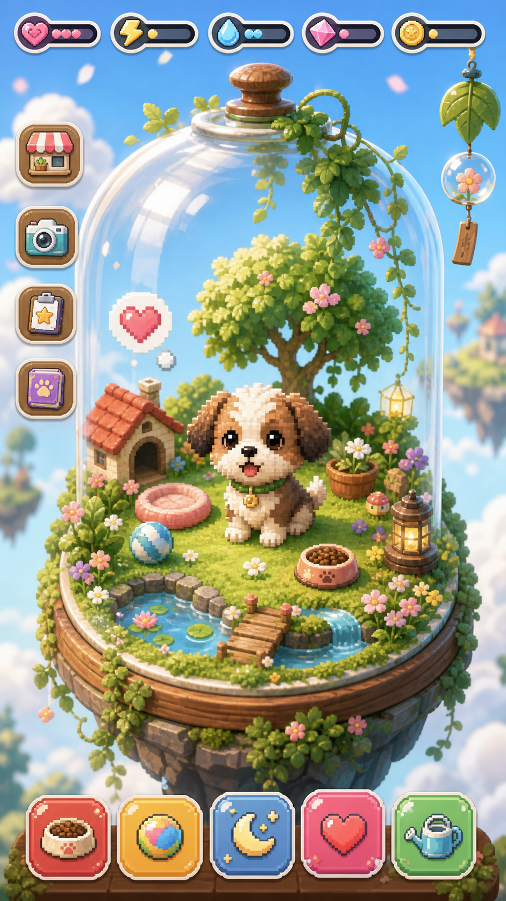

# Mongchi Plan

This is a new standalone pet-life game concept. Do not inherit assumptions from any previous product or repository unless explicitly reselected for this concept.

## Related Documents

- [Organized Part-Based Guide](mongchi-guide/README.md)
- [Execution Plan](mongchi-execution-plan.md)
- [Final Completion Guide](mongchi-completion-guide.md)
- [UX Flow](mongchi-ux-flow.md)
- [Asset Prompt Bible](mongchi-asset-prompt-bible.md)
- [AI Pipeline](mongchi-ai-pipeline.md)
- [Data Model And API](mongchi-data-model-api.md)
- [Reaction Catalog](mongchi-reaction-catalog.md)
- [Security And Privacy](mongchi-security-privacy.md)

## Current Design Lock

Design direction is paused here for now. Use the reference image and prompt below as the visual anchor while planning the app concept, flow, gameplay, items, and MVP.



## Design Prompt

```text
Use this image as the main visual reference. Create a vertical mobile game UI for a cozy pixel terrarium pet-raising game. Keep the floating glass-dome garden, centered personalized pet, crisp pixel-inspired charm, modern rounded care buttons, bright sky mood, and collectible tiny habitat feeling. Make it clean, playable, and iOS/Android app-store ready.

Concept name: Mongchi.

The player uploads a real dog or cat photo, and the app turns it into a cute pixel-inspired companion living inside a tiny floating garden terrarium.

Visual direction: an airy floating garden island inside a cozy glass-dome terrarium. Bright sky, soft clouds, miniature grass paths, flowers, pond, food bowl, toys, tiny home, collectible decorations, and a lovable pet companion in the center.

Style: premium casual mobile game, soft 2.5D illustration mixed with crisp pixel-art charm. Pixel-inspired but not pure retro 8-bit. Fresh, cozy, magical, emotionally warm, clean, and playable.

UI direction: top resource counters, compact side buttons, and bottom icon-only actions for feed, play, sleep, affection, and garden care.

Color palette: sky blue, mint green, apple green, coral, soft yellow, warm white, with small saturated accents.

Avoid: generic room simulator, cluttered UI, dark fantasy, pure pixel art only, photorealism, copying existing games, readable fake text, logos, or brand names.
```

## Confirmed Direction

- The product should combine game-like care loops with a healing companion experience.
- The emotional core is letting people raise and talk with a phone-based version of the pet they deeply love.
- The pet is a digital avatar based on the user's real dog or cat photo, not just a fantasy pet loosely inspired by it.
- AI conversation is a core feature, not an optional side mode. The user should be able to talk to the pet and feel comfort from that interaction.
- The free/default experience should make the pet feel like it is really speaking in short, warm, contextual reactions.
- Full chatbot-style extended conversation can be a paid or premium feature.
- Daily actions should include feeding, talking, receiving comfort, walking, and light care moments.
- Items can start as decoration-only. Later, special consumables such as treats may trigger unique pet behaviors and become a monetization path.
- The target platform direction is iOS and Android, not iOS-only.
- React Native is the preferred starting point because it is familiar and naturally targets both platforms, unless prototype constraints prove another stack is clearly better.
- The first session should immediately guide the user toward photo upload through a warm welcome popup.
- During setup, the user can choose the pet name and personality traits. These choices should feed into later pet reactions and premium chatbot personality.
- The MVP should require one photo. Additional photos can be optional if needed for quality, but should not block onboarding.
- Manual post-generation style editing is skipped for MVP because prior attempts produced disappointing results.
- Walk starts as an idle reward action, not a full interactive walking system.

## Product Implications

- Tone should avoid punishment-heavy Tamagotchi pressure. The game can have needs and routines, but the user should not feel guilty for missing time.
- The AI pet should be framed carefully: emotionally personal and based on the real pet, while still transparently an AI-generated companion.
- The main screen should prioritize the pet, chat/care access, and terrarium life over dense resource systems.
- Monetization should lean toward visible value: decorative items, terrarium themes, extra pets, style regeneration, and special treats that unlock cute behaviors.
- Cross-platform should be planned from the beginning: shared data model, shared asset format, and a client stack decision before implementation.
- The first-time flow must be unusually friendly and guided. Welcome copy, popups, generated illustrations, empty states, and loading scenes should help the user naturally understand why they are uploading a photo and what magical result is coming.

## Conversation Model

- Free baseline: the pet gives short, believable, emotionally warm responses during care moments.
- Free short reactions should be unlimited when they do not call AI.
- Free reactions are state-based and selected from authored/local response pools.
- Reaction pools should vary by hunger, energy, affection, recent play, missed visits, walk status, time of day, and selected personality traits.
- Premium candidate: extended chat mode where the user can have longer conversations with the pet.
- The pet voice should feel like the user's companion, not a generic assistant.
- Conversations should stay comforting, playful, and pet-like rather than becoming productivity chat.
- The product should clearly avoid claiming that the generated pet is the real animal's actual consciousness.

## Photo Upload Strategy

- Default launch strategy: one required pet photo.
- Optional quality booster: let users add two more photos only if they want better identity matching.
- Product framing: "One photo is enough to start. Add more if you want us to understand markings and body shape better."
- Multiple photos can help when a pet has distinctive markings, unusual fur color, or a body shape that one face photo does not capture.
- Multiple photos add friction, so the MVP should not force three photos unless testing proves the quality gap is large.

## First-Time Flow Direction

The current target flow is:

```text
Welcome popup guide
-> Explain the mongchi concept
-> Choose pet name and personality traits
-> Upload one pet photo
-> Friendly generation / hatching scene
-> Preview generated pet
-> Enter first terrarium
-> First short pet message
-> First feeding or affection action
```

Important flow notes:

- The first screen and welcome popup should feel soft, trustworthy, and low-friction.
- Every step should have a clear emotional reason, not just a form field.
- Imagegen-created illustrations should support the flow where useful: welcome art, upload guide, generation scene, hatching/result scene, empty state, and first reward.
- The user should never feel lost during AI generation; the app should show progress as a magical creation moment.
- The setup questions should be lightweight and emotionally framed, for example name, personality, favorite thing, and how the user wants the pet to talk.

## Walk Action Direction

- Walk is MVP-light: the user sends the pet on a short walk and later receives a small idle reward.
- The reward can be affection, a small collectible, a garden item, or a short pet message.
- No full map, GPS, step counter, or interactive walking mini-game is required for MVP.
- Walk can later expand into missions, real-world steps, routes, friend visits, or outdoor item collection.

## Provisional Technical Direction

- Start with React Native as the default candidate because the product targets iOS and Android and the team is already comfortable with it.
- Use shared platform-independent data contracts for pet profile, generated assets, care state, inventory, and conversation state.
- Prefer a lightweight 2D composition approach for MVP before choosing a heavier game engine.
- Reconsider Unity only if the prototype needs complex real-time animation, physics, or mini-games that React Native cannot handle cleanly.
- Reconsider Flutter only if rendering consistency and custom canvas work become more important than React Native familiarity.

## User Decisions Needed

아래 질문에 답하면 이 컨셉을 실제 제품 계획, MVP 범위, 개발 순서로 바꿀 수 있다.

### 1. 제품 정체성

- 런칭 때 강아지/고양이만 지원할 것인가, 토끼/새/햄스터 같은 동물도 열어둘 것인가?
- 사용자는 한 마리의 메인 펫에 집중해야 하는가, 여러 펫을 수집할 수 있어야 하는가?
- 이름/브랜드 톤은 더 귀엽게 갈 것인가, 감성적으로 갈 것인가, 프리미엄하게 갈 것인가?

### 2. 첫 사용자 플로우

- 사진 업로드 전에 데모 펫으로 먼저 체험할 수 있어야 하는가?
- 첫 성공 경험은 이름 짓기, 테라리움 입장, 첫 먹이 주기, 첫 아이템 받기 중 무엇인가?
- 이름/특징 선택에서 어떤 항목을 받을 것인가: 성격, 말투, 좋아하는 것, 보호자 호칭, 추억 메모?

### 3. 데일리 루프

- 사용자가 하루 30초 접속했을 때 무엇을 하게 할 것인가?
- 관리 스탯은 배고픔, 에너지, 행복, 애정도, 청결, 정원 건강 중 무엇을 쓸 것인가?
- 시간이 지나면 스탯이 떨어지는 구조인가, 돌아왔을 때 보상 기회만 생기는 구조인가?
- 하루 이상 접속하지 않아도 부담 없는 구조로 갈 것인가?
- 펫이 슬퍼지거나 아프거나 더러워지는 상태를 허용할 것인가?
- 내일 다시 오게 만드는 이유는 펫의 새 메시지, 데일리 선물, 식물 성장, 아이템 제작, 퀘스트, 사진 추억 중 무엇인가?
- 무료 상태별 반응은 어느 정도까지 세분화할 것인가?

### 4. 게임성

- 핵심 플레이는 탭 케어, 방치 성장, 꾸미기, 수집, 미니게임 중 어디에 무게를 둘 것인가?
- 테라리움 안 식물은 실제 시간에 따라 자라야 하는가?
- 애정도 레벨에 따라 새 행동이나 표정이 열려야 하는가?
- 펫은 테라리움 안을 자유롭게 돌아다녀야 하는가, 중앙에 머물며 액션 애니메이션만 해야 하는가?
- 미니게임을 넣는다면 공놀이, 그루밍, 간식 타이밍, 물주기, 산책 미션 중 무엇이 맞는가?
- 성장은 레벨, 접속 일수, 컬렉션 완성도, 스토리 챕터 중 무엇으로 표현할 것인가?

### 5. 아이템과 컬렉션

- 런칭 아이템 카테고리는 음식, 장난감, 침대, 집, 식물, 지형, 장식, 옷, 액세서리 중 무엇이 필요한가?
- 아이템은 순수 꾸미기인가, 스탯/행동/애니메이션에 영향을 주는가?
- 사용자는 고정 유리돔 안을 꾸미는가, 섬을 확장하는가, 새 테라리움 형태를 여는가?
- 아이템 배치는 자유 배치, 그리드 스냅, 자동 배치 중 무엇인가?
- 아이템 획득은 플레이 보상, 구매, 제작, 선물, AI 생성 중 무엇을 쓸 것인가?
- 레어 아이템은 시즌, 이벤트, 펫 성장, 사진 추억 중 어디에 연결할 것인가?

### 6. AI 생성 범위

- 런칭 때 AI가 반드시 만들어야 하는 것은 펫 아바타, 포즈, 애니메이션, 액세서리, 아이템 아이콘, 테라리움 테마 중 무엇인가?
- AI 결과물 스타일은 픽셀, 2.5D, 스티커, 선택형 프리셋 중 무엇인가?
- 생성 결과 편집은 MVP에서 제외한다. 대신 실패/불만족 시 재생성이나 피드백 플로우를 줄 것인가?
- 재생성은 무료 1회, 제한 없는 무료, 크레딧 기반 중 무엇인가?
- 결과물이 닮지 않았거나 이상하거나 안전하지 않을 때 어떤 플로우로 처리할 것인가?
- 원본 사진은 생성 후 기본 삭제인가, 사용자가 허락하면 재생성용으로 보관인가?

### 7. 경제와 수익화

- 무료 사용자는 첫날 어디까지 즐길 수 있어야 하는가?
- 유료화 대상은 확장 대화, 추가 펫, 스타일 재생성, 프리미엄 테라리움, 아이템팩, 시즌팩, 구독 중 무엇인가?
- 소프트 재화, 프리미엄 재화, 둘 다, 혹은 재화 없음 중 무엇을 선택할 것인가?
- 랜덤박스는 배제하고 보이는 아이템 직접 구매로 갈 것인가?
- AI 생성 비용은 첫 펫 무료 후 크레딧으로 처리할 것인가, 아이템 판매로 보전할 것인가?
- 이 게임이 애정 기반이지 착취적으로 느껴지지 않게 하기 위한 금지선은 무엇인가?

### 8. 공유와 소셜

- 공유는 스틸 이미지, GIF, 짧은 영상, 펫 카드 중 무엇을 우선할 것인가?
- 친구 방문, 물주기, 선물 교환 같은 소셜 기능을 런칭에 넣을 것인가?
- 공개 갤러리, 가족/친구 비공개 공유, 로컬 공유 중 무엇이 맞는가?
- 공유 이미지에 원본 사진 비교를 넣을 것인가, 생성된 아바타만 보여줄 것인가?

### 9. 플랫폼과 기술 방향

- 케어 액션은 오프라인에서도 동작해야 하는가?
- 서버가 진실이어야 하는 상태는 결제, AI job, 인벤토리, 케어 스탯, 데일리 보상 중 무엇인가?
- 애니메이션은 sprite frame, Spine/Rive/Lottie, transform animation, 생성 GIF sheet 중 무엇인가?
- React Native MVP에서 테라리움 렌더러는 UI composition, Skia/canvas, Rive/Lottie 조합 중 무엇으로 검증할 것인가?

### 10. MVP 범위

- 우리가 만들 수 있는 가장 작은데 사랑스러운 버전은 무엇인가?
- MVP 필수 화면은 몇 개인가?
- MVP에서 명시적으로 제외할 기능은 무엇인가?
- 첫 검증 지표 3개는 무엇인가?
- 첫 수익화 실험을 할 것인가, 아니면 retention 검증 후 할 것인가?
- 본격 제작 전에 반드시 증명해야 할 것은 AI 품질, 펫 애착, 재방문율, 아이템 경제, 크로스 플랫폼 렌더링 중 무엇인가?

## Candidate MVP Shape

아직 확정이 아닌 시작 가설이다.

- 한 장의 강아지/고양이 사진으로 한 마리의 메인 펫을 만든다.
- 선택적으로 추가 사진 2장을 받을 수 있지만 필수는 아니다.
- 생성 전 이름과 성격/특징을 고르게 해서 reaction system과 premium chat에 연결한다.
- 생성 결과의 수동 편집은 MVP에서 제외한다.
- 생성된 펫은 idle, happy, sleep, play 상태를 가진다.
- 기본 Mongchi 하나에 펫을 배치한다.
- 케어 액션은 먹이, 대화, 산책, 쓰다듬기, 정원 물주기 5개로 시작한다.
- AI 대화는 홈 화면에서 바로 접근 가능한 핵심 액션으로 둔다.
- 무료 사용자는 AI를 호출하지 않는 상태별 짧은 pet-like 반응을 무제한으로 받는다.
- 긴 챗봇형 대화는 premium/BM 후보로 둔다.
- 스탯은 에너지, 행복, 정원 건강, 애정도 정도로 단순하게 둔다.
- 하루 한 번 선물과 간단한 milestone 보상을 준다.
- 산책은 "보냈다"는 idle action과 보상 회수로 시작한다.
- 작은 starter item collection과 간단한 꾸미기를 제공한다.
- 간식은 MVP에서는 기본 보상 아이템으로만 두고, 추후 특별 행동/BM 후보로 남긴다.
- 공유용 이미지 export를 지원한다.
- iOS와 Android를 모두 목표로 하되, MVP 구현 방식은 별도 기술 결정에서 확정한다.
- 소셜, 여러 펫, 고급 미니게임, 구독은 검증 이후로 미룬다.
